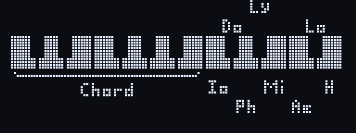

# Playing

The screen shows the 20 pedals as a keyboard, with held pedals hollow. When
holding something for a second triggers an action, a line runs round the
edge of the screen; the action happens when it closes. Without playing, the
screen dims after a minute and turns off after five, and after ten the
pedalboard goes into deep sleep (see `display.dim_s`, `display.off_s` and
`power.sleep_s`); any pedal or button wakes it and plays as usual. With
`power.battery` set, the charge shows in the bottom right corner, with `!`
when nearly empty, or a lightning bolt on USB power.

## Normal mode

Each pedal plays its note (C is MIDI 48 at octave 3).

- **One octave button:** octave up or down; hold to repeat.
- **Both briefly:** chord mode on or off, or mode mode if that was last
  used (see `keys.alternative`).
- **Both for a second:** config mode. Entering it also silences the synth,
  in case a note got stuck.

## Chord mode

The lower twelve pedals play a chord on their note; the upper eight pick the
chord type (M7 Major 7th, M Major, m7 Minor 7th, m Minor, d7 Diminished 7th,
h7 Half-diminished 7th, 7 Dominant 7th) and turn hold on or off (H).

- One chord sounds at a time. A root pressed while a chord sounds plays as
  soon as you release the current one.
- The sounding chord's notes are dotted on the screen, its root solid.
- **Hold** keeps the chord sounding after release until the next root.
- The octave buttons work as in normal mode.
- **Hold H for a second:** switch to [mode mode](#mode-mode); hold stays as
  it was. The pedalboard remembers which of the two you used last.

## Mode mode

The lower twelve pedals play the chords of a key, so every chord fits the
scale; the upper seven pick the mode (Io Ionian, Do Dorian, Ph Phrygian,
Ly Lydian, Mi Mixolydian, Ae Aeolian, Lo Locrian) and H turns hold on or
off. The screen shows the key, e.g. `D Dorian`.

- **Tonic:** after power-up, picking a mode or switching to mode mode,
  the first pedal you play is the tonic. Until then the screen shows e.g.
  `? Dorian`.
- **Pedals in the scale** play their seventh chord from the scale: in
  C Ionian, D plays D minor 7th and G plays G dominant 7th.
- **Pedals outside the scale** play a triad: that of the scale note with
  the same letter. In D Ionian (sharps), C is taken as C♯ and plays C♯
  diminished; in F Ionian (flats), B is taken as B♭ and plays B♭ major. In
  keys without sharps or flats it is the note below: in C Ionian, C♯ plays
  C major.
- One chord at a time, hold and the marks on screen work as in chord mode.
- **Hold H for a second:** back to chord mode.

## Config mode

| Pedals | Setting (range) |
|--------|-----------------|
| C / D | Screen brightness, `Contrast` (0–16) |
| E / F | Velocity (1–127) |
| E + F held | [Expression pedal](#expression-pedal) on or off |
| G / A | [Sound](#sounds): the synth's own, or one from the list |
| B / C' | Transpose, `Transp.` (−12 to +12) |
| D' / E' | Debounce, ms (0–50): raise it if pedals play twice or notes sound on their own |
| F' | Battery voltage, type and charge, or `External power` (with `power.battery` set) |
| G' held | USB flash mode, to install new firmware |

The left pedal of each pair turns the setting down, the right one up; hold
to keep changing. A tap on G', or 3 seconds without touching anything, goes
back to the map above. From the map, a tap on G' or any other pedal leaves
config mode and saves.

## Sounds

By default the pedalboard leaves the sound to the synth: choose it there.
G and A in config mode step through the list in
[`piedalera.ini`](configuration.md#sounds) instead; each sound is sent to
the synth as soon as it shows, and again at power-up. Going back to
`Synth's own` sends nothing, so the synth keeps the last sound until it is
changed there.

## Expression pedal

The pedal on EXP1 sends controller 11 (Expression, or `expression.cc`) in
every mode once turned on.

- **On:** in config mode, hold E and F together for a second. Its page
  shows `On`; push the pedal from heel to toe and back while the bar
  follows it. Once it has moved far enough the value shows next to the bar
  and the pedal starts sending. The travel is saved and kept from then on.
- **Off:** hold E and F again. It sends 127, so the synth isn't left quiet,
  and forgets the travel: turning it on again learns it afresh, e.g. for
  another pedal.
- **Unplugged:** it sends 127 and is ignored until plugged back in; either
  is noticed within half a second.
- The travel is only learnt in config mode, on the map or the pedal's page.
  If the pedal doesn't reach 0 or 127, push it to its ends there again: the
  travel only ever widens.
- In config mode, moving the pedal shows its page and value.
