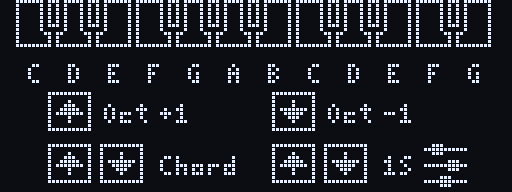
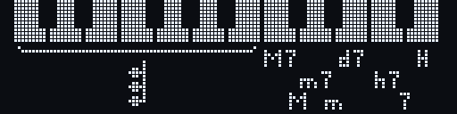
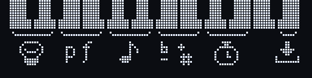

# Playing

The screen shows the 20 pedals as a keyboard, with held pedals filled. When
holding something for a second triggers an action, a line runs round the
edge of the screen; the action happens when it closes. Without playing, the
screen dims after a minute and turns off after five, and after ten the
pedalboard goes into deep sleep (see `display.dim_s`, `display.off_s` and
`power.sleep_s`); any pedal or button wakes it and plays as usual.

## Normal mode

Each pedal plays its note (C is MIDI 48 at octave 3).

- **One octave button:** octave up or down; hold to repeat.
- **Both briefly:** chord mode on or off.
- **Both for a second:** config mode. Entering it also silences the synth,
  in case a note got stuck.

## Chord mode

The lower twelve pedals play a chord on their note; the upper eight pick the
chord type (M7 Major 7th, M Major, m7 Minor 7th, m Minor, d7 Diminished 7th,
h7 Half-diminished 7th, 7 Seventh) and turn hold on or off (H).

- One chord sounds at a time. A root pressed while a chord sounds plays as
  soon as you release the current one.
- **Hold** keeps the chord sounding after release until the next root.
- The octave buttons work as in normal mode.

## Config mode

| Pedals | Setting (range) |
|--------|-----------------|
| C / D | Screen brightness, `Contrast` (0–16) |
| E / F | Velocity (1–127) |
| E + F held | [Expression pedal](#expression-pedal) on or off |
| G / A | Sound variation, `Bank` (0–127) |
| B / C' | Transpose, `Transp.` (−12 to +12) |
| D' / E' | Debounce, ms (0–50): raise it if pedals play twice |
| F' | Battery voltage, type and charge, when `power.battery` is set; the map shows the charge under F' and blinks `!` when nearly empty |
| G' held | USB flash mode, to install new firmware |

The left pedal of each pair turns the setting down, the right one up; hold
to keep changing. A tap on G', or 3 seconds without touching anything, goes
back to the map above. From the map, a tap on G' or any other pedal leaves
config mode and saves.

## Expression pedal

The pedal on EXP1 sends controller 11 (Expression, or `expression.cc`) in
every mode once turned on.

- **On:** in config mode, hold E and F together for a second. Its page
  shows `On`; push the pedal from heel to toe and back while the bar
  follows it. Once it has moved far enough the value shows next to the bar
  and the pedal starts sending. The travel is saved and kept from then on.
- **Off:** hold E and F again. It sends 127, so the synth isn't left quiet,
  and forgets the travel: turning it on again learns it afresh, e.g. for
  another pedal.
- The travel is only learnt in config mode, on the map or the pedal's page,
  so unplugging the pedal while playing can't spoil it. If the pedal
  doesn't reach 0 or 127, open config mode and push it to its ends again:
  the travel only ever widens.
- In config mode, moving the pedal shows its page and value.
